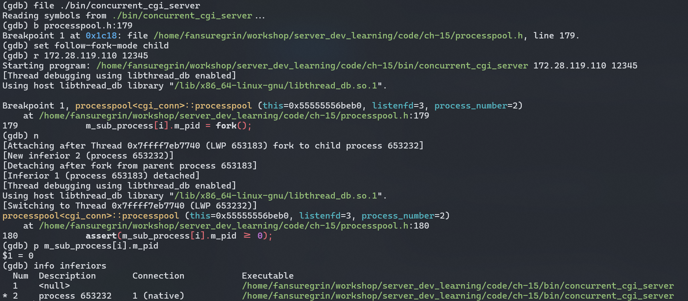
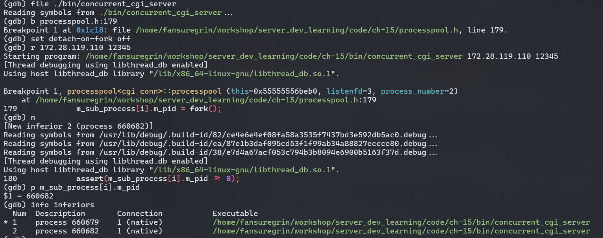
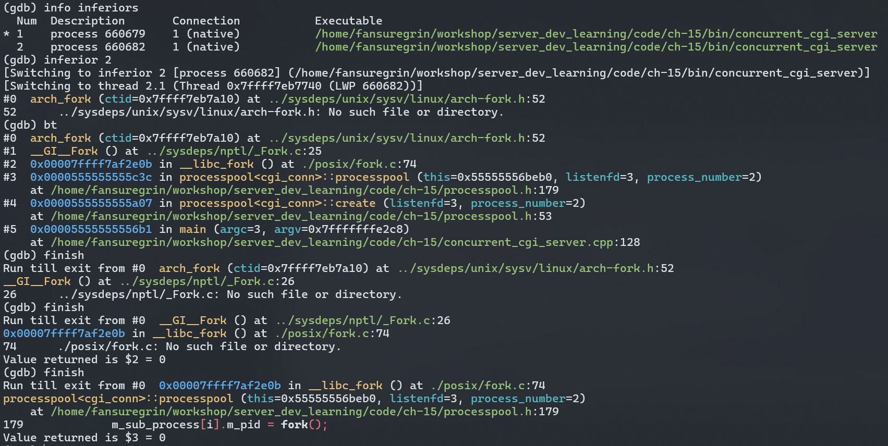
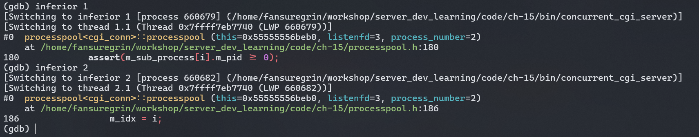

# 多进程程序的调试

*此文记录如何在类Unix平台使用 [GDB](https://www.sourceware.org/gdb/) 来调试**多进程**程序。* 当一个进程使用`fork`调用创建了一个子进程后，gdb默认会继续调试原来的进程，子进程会正常运行。那么，如何才能调试子进程呢？可以通过两种方法实现。

## 1.单独调试子进程
在 GDB 的官方文档中提到可以用`attach`来[调试已经在运行的进程](https://sourceware.org/gdb/current/onlinedocs/gdb.html/Attach.html)。

下面以一个具体案例来展开介绍。我运行一个多进程程序 `concurrent_cgi_server` (它由[这个源文件](../../code/ch-15/concurrent_cgi_server.cpp)编译而成)。

```sh
$ ./bin/concurrent_cgi_server 172.28.119.110 12345
```

通过`ps`命令，可以看到父进程的`pid`为**610178**，它拥有两个子线程，其`pid`分别为**610179**和**610180**。
```
$ ps -ef | grep cgi_server
fansure+  610178  256477  0 17:04 pts/7    00:00:00 ./bin/concurrent_cgi_server 172.28.119.110 12345
fansure+  610179  610178  0 17:04 pts/7    00:00:00 ./bin/concurrent_cgi_server 172.28.119.110 12345
fansure+  610180  610178  0 17:04 pts/7    00:00:00 ./bin/concurrent_cgi_server 172.28.119.110 12345
fansure+  610578  325475  0 17:05 pts/10   00:00:00 grep cgi_server
```
接着我们启动**GDB**。
```
$ gdb
GNU gdb (Debian 13.1-3) 13.1
Copyright (C) 2023 Free Software Foundation, Inc.
License GPLv3+: GNU GPL version 3 or later <http://gnu.org/licenses/gpl.html>
This is free software: you are free to change and redistribute it.
There is NO WARRANTY, to the extent permitted by law.
Type "show copying" and "show warranty" for details.
This GDB was configured as "x86_64-linux-gnu".
Type "show configuration" for configuration details.
For bug reporting instructions, please see:
<https://www.gnu.org/software/gdb/bugs/>.
Find the GDB manual and other documentation resources online at:
    <http://www.gnu.org/software/gdb/documentation/>.

For help, type "help".
Type "apropos word" to search for commands related to "word".
(gdb)
```
进入gdb的交互界面后，使用`attch`命令将子进程**610179**附加到gdb调试器。

```
(gdb) attch 610179
Attaching to process 610179
Reading symbols from /home/fansuregrin/workshop/server_dev_learning/code/ch-15/bin/concurrent_cgi_server...
Reading symbols from /lib/x86_64-linux-gnu/libstdc++.so.6...
(No debugging symbols found in /lib/x86_64-linux-gnu/libstdc++.so.6)
Reading symbols from /lib/x86_64-linux-gnu/libgcc_s.so.1...
(No debugging symbols found in /lib/x86_64-linux-gnu/libgcc_s.so.1)
Reading symbols from /lib/x86_64-linux-gnu/libc.so.6...
Reading symbols from /usr/lib/debug/.build-id/82/ce4e6e4ef08fa58a3535f7437bd3e592db5ac0.debug...
Reading symbols from /lib/x86_64-linux-gnu/libm.so.6...
Reading symbols from /usr/lib/debug/.build-id/ea/87e1b3daf095cd53f1f99ab34a88827eccce80.debug...
Reading symbols from /lib64/ld-linux-x86-64.so.2...
Reading symbols from /usr/lib/debug/.build-id/38/e7d4a67acf053c794b3b8094e6900b5163f37d.debug...
[Thread debugging using libthread_db enabled]
Using host libthread_db library "/lib/x86_64-linux-gnu/libthread_db.so.1".
0x00007efeb2527de3 in epoll_wait (epfd=4, events=0x7fff8cf7b8f0, maxevents=10000, timeout=-1) at ../sysdeps/unix/sysv/linux/epoll_wait.c:30
30      ../sysdeps/unix/sysv/linux/epoll_wait.c: No such file or directory.
```

我们再使用`bt`命令看下当前先子进程的调用栈情况。从下面的结果可以看到，子进程<pid=610179>处于epoll_wait系统调用内部，正在等待事件。
```
(gdb) bt
#0  0x00007efeb2527de3 in epoll_wait (epfd=4, events=0x7fff8cf7b8f0, maxevents=10000, timeout=-1) at ../sysdeps/unix/sysv/linux/epoll_wait.c:30
#1  0x000055f3608b2e3b in processpool<cgi_conn>::run_child (this=0x55f361a78eb0)
    at /home/fansuregrin/workshop/server_dev_learning/code/ch-15/processpool.h:240
#2  0x000055f3608b2a62 in processpool<cgi_conn>::run (this=0x55f361a78eb0)
    at /home/fansuregrin/workshop/server_dev_learning/code/ch-15/processpool.h:218
#3  0x000055f3608b26c8 in main (argc=3, argv=0x7fff8cf98f98)
    at /home/fansuregrin/workshop/server_dev_learning/code/ch-15/concurrent_cgi_server.cpp:130
```

我们接着在`processpool.h:240`(即processpool.h的第240行)处打上断点。
```
(gdb) b processpool.h:240
Breakpoint 1 at 0x55f3608b2e19: file /home/fansuregrin/workshop/server_dev_learning/code/ch-15/processpool.h, line 240.
```

然后，我们让程序继续执行。
```
(gdb) c
Continuing.

Breakpoint 1, processpool<cgi_conn>::run_child (this=0x55f361a78eb0)
    at /home/fansuregrin/workshop/server_dev_learning/code/ch-15/processpool.h:240
240             number = epoll_wait(m_epollfd, events, MAX_EVENT_NUMBER, -1);
(gdb) c
Continuing.
```

我们现在开启另一个终端，使用`telnet`连接这个服务器程序。从下面的结果可以看到，客户端已经和服务器取得了连接。
```
$ telnet 172.28.119.110 12345
Trying 172.28.119.110...
Connected to 172.28.119.110.
Escape character is '^]'.
```
服务器端显示已经将客户请求交给子进程**[0]**去处理。此处的子进程0应该是<pid=610179>这个进程。
```
send request to child [0]
```
再看gdb这边，也是停在了断点处。
```
Breakpoint 1, processpool<cgi_conn>::run_child (this=0x55f361a78eb0)
    at /home/fansuregrin/workshop/server_dev_learning/code/ch-15/processpool.h:240
240             number = epoll_wait(m_epollfd, events, MAX_EVENT_NUMBER, -1);
(gdb) bt
#0  processpool<cgi_conn>::run_child (this=0x55f361a78eb0) at /home/fansuregrin/workshop/server_dev_learning/code/ch-15/processpool.h:240
#1  0x000055f3608b2a62 in processpool<cgi_conn>::run (this=0x55f361a78eb0)
    at /home/fansuregrin/workshop/server_dev_learning/code/ch-15/processpool.h:218
#2  0x000055f3608b26c8 in main (argc=3, argv=0x7fff8cf98f98)
    at /home/fansuregrin/workshop/server_dev_learning/code/ch-15/concurrent_cgi_server.cpp:130
```

接下来就可以用`next`来单步调试这个子进程了。

## 2.使用调试器选项 `follow-fork-mode`

通过设置`follow-fork-mode`，可以让调试器决定fork之后是继续调试父进程还是子进程，其可选的值有`parent`和`child`。默认情况下，`follow-fork-mode`的值为`parent`，我们可以通过`show follow-fork-mode`来查看。

还是以上面的`concurrent_cgi_server`程序为例子进行演示。这次，我们直接在gdb中运行这个程序。
从下面的图中可以看到fork之后，gdb从原来的父进程上detach了下来，转向调试子进程了。


## 3.设置选项`detach-on-fork` 和使用 [`inferiors`](https://sourceware.org/gdb/current/onlinedocs/gdb.html/Inferiors-Connections-and-Programs.html#Inferiors-Connections-and-Programs)

但是，上述做法只能继续调试子进程，而不能调试父进程。如果要去调试父进程，则只能从子进程上`detach`下来，再用`attach`命令去附着到父进程上。这样一会儿detach一会儿又attach，非常不方便。好在gdb提供一个`inferiors`命令，可以在一个gdb session下，在不同的**inferior**之间切换。至于，什么是**inferior**，gdb的官方手册是这么解释的：

> GDB represents the state of each program execution with an object called an inferior. An inferior typically corresponds to a process, but is more general and applies also to targets that do not have processes. Inferiors may be created before a process runs, and may be retained after a process exits. Inferiors have unique identifiers that are different from process ids. Usually each inferior will also have its own distinct address space, although some embedded targets may have several inferiors running in different parts of a single address space. Each inferior may in turn have multiple threads running in it.

> Gemini翻译：GDB 用一个叫做 inferior 的对象表示每次程序执行的状态。一个 inferior 通常对应一个进程，但概念更宽泛，也适用于没有进程的目标。可以在进程运行之前创建 inferior，并在进程退出后保留 inferior。Inferior 拥有唯一的标识符，不同于进程 ID。通常每个 inferior 都将拥有自己独立的地址空间，尽管一些嵌入式目标可能有多个 inferior 在单个地址空间的不同部分中运行。每个 inferior 还可以依次有多个线程在其内部运行。

gdb还提供一个叫`detach-on-fork`的选项，其默认值为`on`，表示fork之后从父进程上分离。我们可以设置其值为`off`，这样子进程和父进程就不会分离，而是称为这个session中的两个inferior。


上图中，我们通过`info inferiors`可以看到两个inferior。


通过`inferior 2`可以切换到子进程。


在调试子进程的过程中，也可以通过`inferior 1`，切换回父进程。